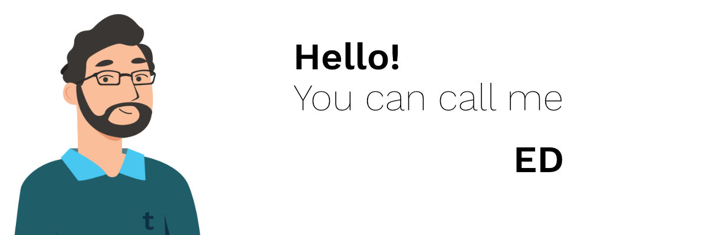
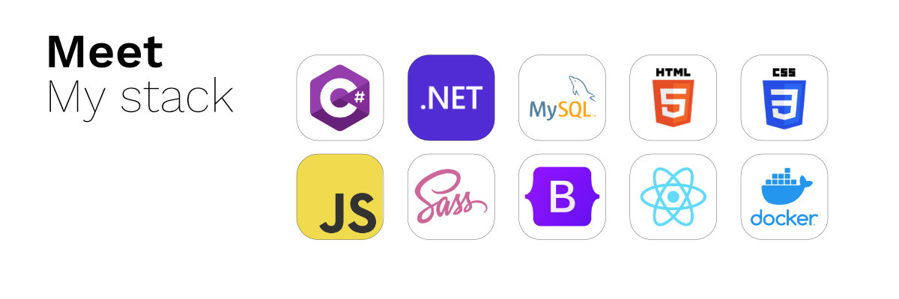

# 👋🏻 About me!
I was born and grew up in Guatemala City . I love to read, paint and make music. I'm a major in audio engineering and a minor in arts. I'm very passionate about technology and love to research about new tools and technologies. I'm a self taught developer! Nice to meet you!

Currently I'm working in growing [tipi(code)](https://codingtipi.com), a company that focuses on developing and managing technologies to help with everyday tasks, we proudly focus on developer experience so you bring wonderful ideas to life without worrying about infrastructure and maintnence. I love to build communities and develop new experiences for developers.

